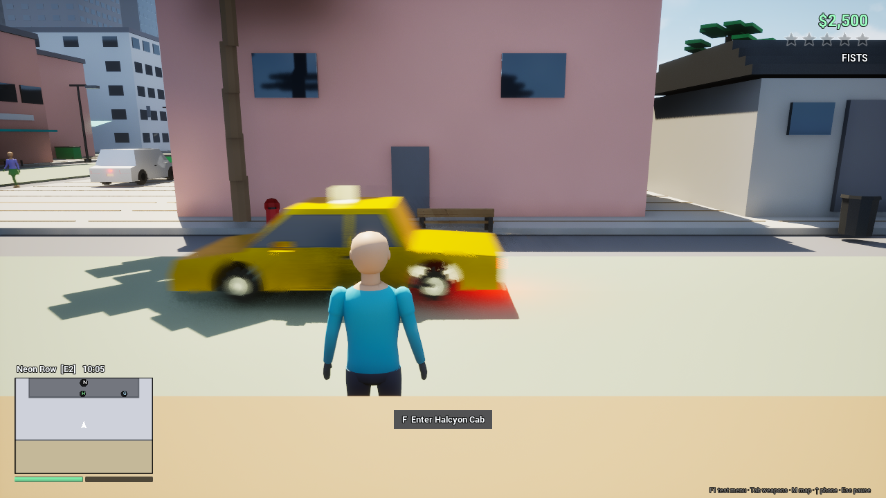
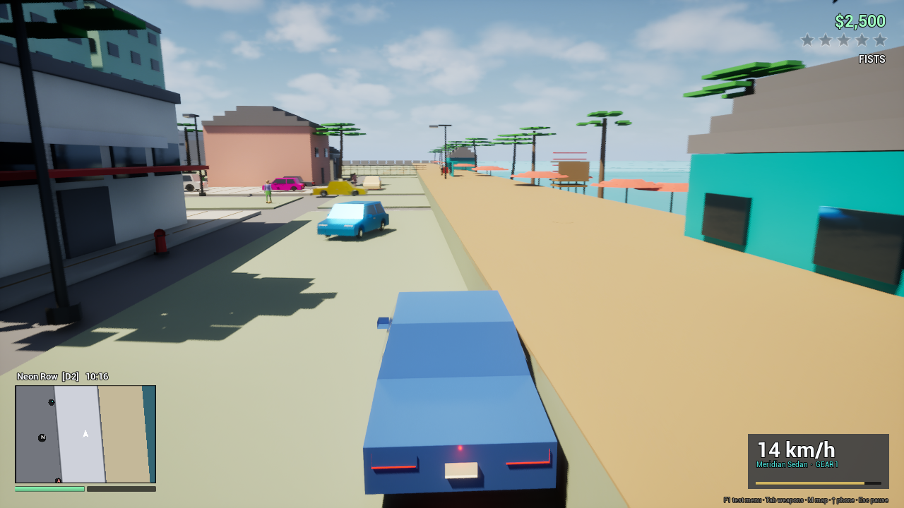
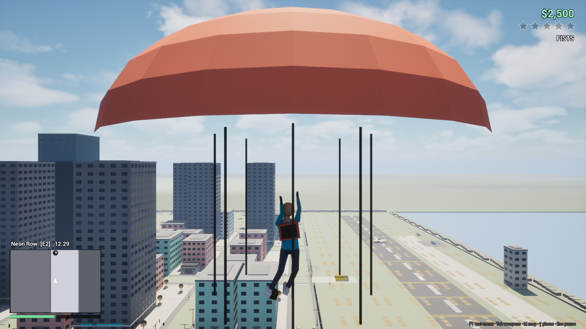

# Port Halcyon — Unreal Engine 5

Оригинальная одиночная GTA-подобная sandbox-игра без кампании, квестов и миссий. Проект использует Unreal Engine **5.8.2**, C++ и собственные Blender-ассеты.

| Транспорт | Парашют |
|---|---|
|  |  |

## Самый простой запуск

### Windows — без установки Unreal Engine

1. Откройте [последний Release](https://github.com/Prokopiy8247/Opus-5-5-GTA-Unity-Godot-Unreal-Engine-5/releases/latest).
2. Скачайте `Port-Halcyon-Windows-x64.zip`.
3. Полностью распакуйте архив в обычную папку.
4. Дважды щёлкните `Play Port Halcyon.bat` или `Unreal_Opus5_5_GTA.exe`.

Не запускайте EXE прямо из окна архиватора: рядом с ним нужны папки `Engine` и `Unreal_Opus5_5_GTA`.

### macOS

Готовый `.app` нельзя корректно создать на Windows: Unreal Engine собирает Mac-приложение на macOS с Xcode. Для Mac предоставлен максимально простой исходный запуск:

1. Установите Unreal Engine **5.8.x** через Epic Games Launcher и совместимую с ним версию Xcode.
2. Клонируйте репозиторий или скачайте Source ZIP.
3. В Finder откройте эту папку.
4. Дважды щёлкните `Open Project - macOS.command`.
5. После первой компиляции нажмите Play в Unreal Editor.

macOS может попросить разрешение на запуск `.command`: нажмите файл правой кнопкой → **Open / Открыть**. Для создания самостоятельного `.app` используйте `Build Game - macOS.command`. Подробности: [LAUNCH_GUIDE.md](./LAUNCH_GUIDE.md).

## Управление

| Клавиша | Действие |
|---|---|
| WASD / мышь | Движение / камера / управление транспортом |
| Shift | Бег; тяга/подъём воздушного транспорта |
| Space | Прыжок, перелезание или ручной тормоз |
| Ctrl / C | Скрытное передвижение / снижение |
| F | Войти, выйти, угнать транспорт; раскрыть парашют |
| E | Взаимодействие / сирена |
| ЛКМ / ПКМ / R | Огонь или удар / прицел / перезарядка |
| Tab / колесо / 1–9 | Колесо и выбор оружия |
| Q / X / B | Укрытие / уклонение / блок |
| V | Переключить вид камеры |
| H / L / T | Сигнал / свет / крыша кабриолета |
| M / стрелка вверх | Карта / телефон |
| F1 | Меню быстрого тестирования |
| Esc | Пауза и сохранение |

## Что включено

- карта Port Halcyon примерно 600×600 м с несколькими районами;
- персонаж, NPC, пешеходы и дорожный трафик;
- автомобили, мотоцикл, велосипед, катер, вертолёты и самолёты;
- оружие, полиция, свидетели и розыск 0–5;
- магазины, гараж, экономика, сохранение, погода и смена времени;
- плавание, ныряние, парашют и простая дикая природа;
- исходный Blender-файл `UnrealOpus5.5GTA.blend`; готовые импортированные ассеты находятся в `Content`;
- исходный benchmark-prompt: `Claude_Opus_5.5_UnrealEngine5_GTA_BlenderMCP_Prompt.md`.

Проект имеет намеренно простой стилизованный визуальный уровень. Не все дополнительные механики одинаково отполированы; честный статус находится в [FEATURE_MATRIX.md](./FEATURE_MATRIX.md).

## Разработка

- Unreal Engine 5.8.2;
- Visual Studio 2022/2026 с C++ workload на Windows или Xcode на macOS;
- проект открывается файлом `Unreal_Opus5_5_GTA.uproject`;
- движок и его исходники в репозиторий не включены;
- папки `Binaries`, `Intermediate`, `Saved`, `DerivedDataCache`, `Builds` создаются локально и игнорируются Git.

Весь важный 3D-контент создан для проекта в Blender; часть технической геометрии, коллизий и размещения мира создаётся кодом Unreal.
